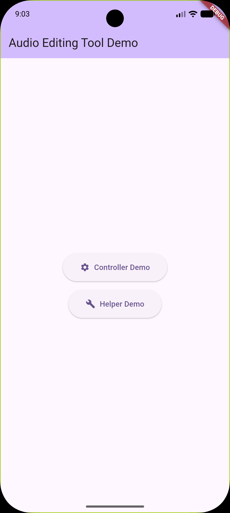
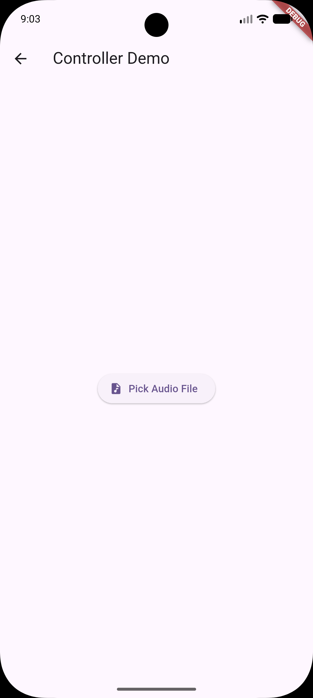
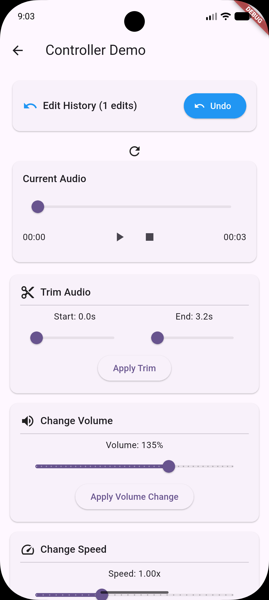

# Audio Editing Tool

Lightweight audio editing for Flutter with an easy, practical API :)

## Screenshots





## Features

* **Trim audio** - Cut audio files to specific start and end times
* **Volume control** - Adjust audio volume with configurable factors
* **Speed adjustment** - Change playback speed while preserving pitch
* **Fade effects** - Apply fade-in and fade-out transitions
* **Format conversion** - Convert between audio formats (MP3, WAV & etc.)
* **Audio merging** - Combine multiple audio files into one
* **Feel free to explore more**

## Getting Started

Add this package to your `pubspec.yaml`:

```yaml
dependencies:
  audio_editing_tool: ^1.0.0
```

Then import the package in your Dart file:

```dart
import 'package:audio_editing_tool/audio_editing_tool.dart';
```

## Usage

This package offers two approaches to audio editing: the **Controller** pattern for stateful editing sessions with history tracking, and the **Helper** pattern for one-off operations (Aka, Fire and Forget without dispose).

### Using the Controller

The `AudioEditingController` manages edit history, temporary files, and provides undo functionality. Ideal for interactive editing sessions.

```dart
// Initialize the controller with an audio file
final controller = AudioEditingController();
await controller.init('/path/to/audio.mp3');

// Perform editing operations
await controller.trim(10.0, 30.0);  // Trim from 10s to 30s
await controller.changeVolume(1.5);  // Increase volume by 50%

// Get the current edited file path
String? currentFile = controller.filePath;

// Get audio duration (in milliseconds)
int duration = await controller.audioDuration();

// Undo the last operation
if (controller.canUndo) {
  await controller.undo();
}

// Access edit history
List<String> editedFiles = controller.editedAudioFiles;

// Cleanup when done
await controller.dispose();
```

### Using the Helper

The `AudioEditorHelper` provides static methods for individual operations. Suitable for simple, stateless audio processing.

// Change volume (factor: 2.0 = double, 0.5 = half)
final volumeResult = await AudioEditorHelper.changeVolume('/path/to/audio.mp3', 1.5);

// Change speed
final speedResult = await AudioEditorHelper.changeSpeed('/path/to/audio.mp3', 1.25);

// Fade effects
await AudioEditorHelper.fadeIn('/path/to/audio.mp3', 2.0);
await AudioEditorHelper.fadeOut('/path/to/audio.mp3', 2.0);

// Convert format
await AudioEditorHelper.convertTo('/path/to/audio.wav', '.mp3');

// Compress audio
await AudioEditorHelper.compress('/path/to/audio.mp3');

// Cleanup temporary files
await AudioEditorHelper.dispose();
```

### Controller vs Helper

**Use the Controller when:**
* You need to maintain edit history and undo functionality
* You want automatic temporary file management
* You're building an interactive audio editing interface

**Use the Helper when:**
* You want stateless operations without history tracking

## Additional Information

All operations are asynchronous and return results that you should handle appropriately. The controller automatically manages temporary files created during editing sessions, while the helper & controller methods require manual cleanup using `AudioEditorHelper.dispose()` when finished with a batch of operations.

For complete examples, see the `/example` directory in this package.